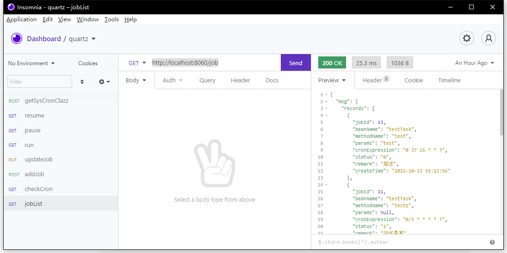
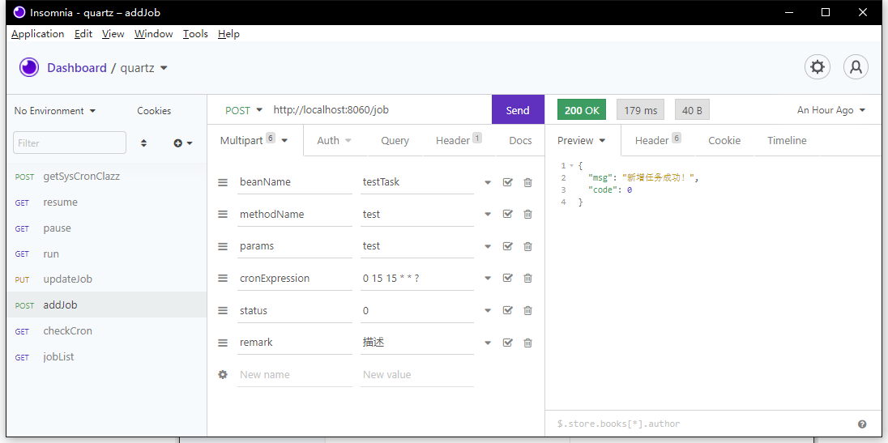
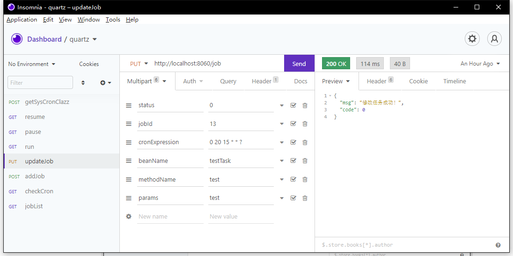
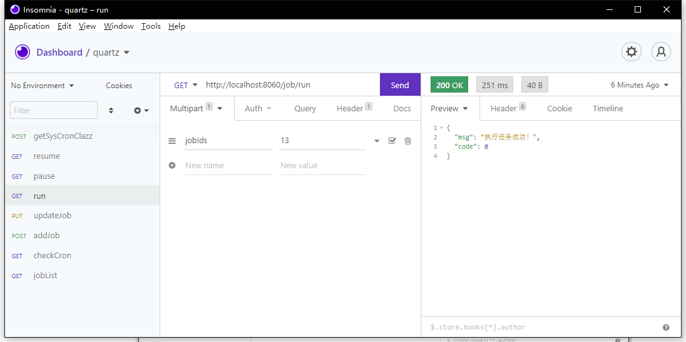
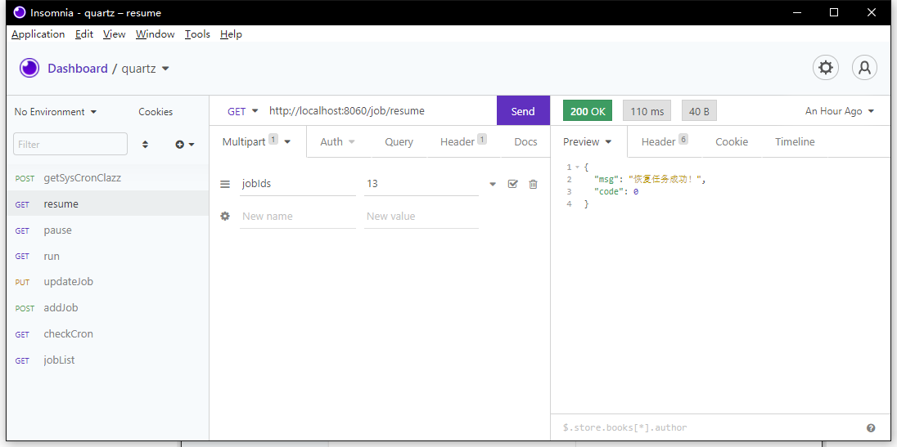
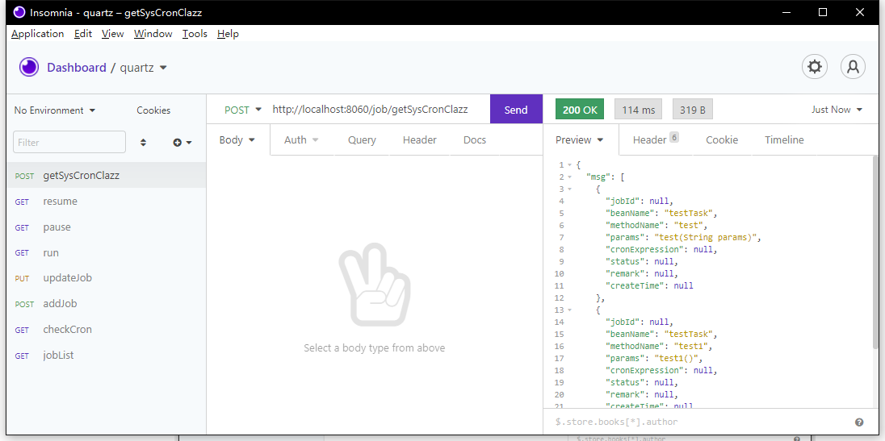

## 任务调度

###  项目介绍：

本项目使用的是数据库模式。前面在导入数据表的时候也提到了，QRTZ_开头的数据表就是用于维护任务调度使用的。

创建定时任务很简单，只需要在com.source.task目录下（或者任何能够被Spring上下文扫描到的路径）创建一个任务类，然后编写需要调度的方法，如：

```java
package com.source.task;

import com.source.annotation.CronTag;
import lombok.extern.slf4j.Slf4j;

/**
 * Created with IntelliJ IDEA.
 * Job
 * @author Source
 * @date 2021/10/12/14:44
 */
@CronTag("testTask")
@Slf4j
public class TestTask {

    public void test() {
        log.info("我是不带参数的test方法，正在被执行");
    }

}
```

其中`@CronTag("testTask")`表明该类为一个任务调度类，`testTask`表示其名称。


参数说明：

1. Bean名称对应`@CronTag("testTask")`中的`testTask`，表示Spring容器中的Bean的名称；
2. 方法名称对应上面定义的test方法；
3. 方法参数指定了方法`test(String params)`参数`params`的值为test；
4. cron表达式用于指定任务调度的规则，这里表示每隔1秒触发；
5. 备注用于简单描述该调度方法的作用。

新增后的调度任务为暂停状态。任务状态分为暂停和正常。

在“定时任务”页面的右上角有三个和任务状态相关的按钮，这里简单描述下它们的作用：

1. **立即执行任务**：选中任务点击该按钮，被选中的任务会马上执行。如果任务是暂停状态的，那么只执行一次；如果任务是正常状态的，则开始安装cron表达式规则持续的调用该任务；
2. **暂停任务**：将任务的状态变更为暂停状态；
3. **恢复任务**：将任务的状态变更为正常状态。恢复正常状态的任务并不会马上就开始持续调度，只有当系统重启或者点击立即执行后才会进行持续调度。

下面是`testTask`的`test`方法持续调度的日志：

控制台：

```verilog
2021-10-13 16:40:50 |INFO  |MyScheduler_Worker-1 |ScheduleJob.java:45 |com.source.util.ScheduleJob |任务准备执行，任务ID：13
2021-10-13 16:40:50 |INFO  |pool-2-thread-1 |TestTask.java:17 |com.source.task.TestTask |我是带参数的test方法，正在被执行，参数为：test
2021-10-13 16:40:50 |INFO  |MyScheduler_Worker-1 |ScheduleJob.java:55 |com.source.util.ScheduleJob |任务执行完毕，任务ID：13 总共耗时：2 毫秒
2021-10-13 16:40:50 |DEBUG |MyScheduler_Worker-1 |BaseJdbcLogger.java:143 |com.source.mapper.JobLogMapper.insert |==>  Preparing: INSERT INTO t_job_log (METHOD_NAME, PARAMS, JOB_ID, TIMES, CREATE_TIME, BEAN_NAME, `STATUS`) VALUES (?, ?, ?, ?, ?, ?, ?) 
2021-10-13 16:40:50 |DEBUG |MyScheduler_Worker-1 |BaseJdbcLogger.java:143 |com.source.mapper.JobLogMapper.insert |==> Parameters: test(String), test(String), 13(Long), 2(Long), 2021-10-13 16:40:50.683(Timestamp), testTask(String), 0(String)
2021-10-13 16:40:50 |DEBUG |MyScheduler_Worker-1 |BaseJdbcLogger.java:143 |com.source.mapper.JobLogMapper.insert |<==    Updates: 1
2021-10-13 16:40:50 |INFO  |MyScheduler_Worker-1 |SqlStatementInterceptor.java:69 |com.source.interceptor.SqlStatementInterceptor |【SQL_ID】 com.source.mapper.JobLogMapper.insert
2021-10-13 16:40:50 |INFO  |MyScheduler_Worker-1 |SqlStatementInterceptor.java:70 |com.source.interceptor.SqlStatementInterceptor |【SQL耗时】 20 ms
2021-10-13 16:40:50 |INFO  |MyScheduler_Worker-1 |SqlStatementInterceptor.java:71 |com.source.interceptor.SqlStatementInterceptor |【SQL语句】 INSERT INTO t_job_log ( METHOD_NAME, PARAMS, JOB_ID, TIMES, CREATE_TIME, BEAN_NAME, `STATUS` ) VALUES ( 'test', 'test', 13, 2, '2021-10-13 16:40:50', 'testTask', '0' )

```


### 项目启动：

项目地址： https://github.com/MaoSource/source_quartz.git

1. git代码到本地
2. 下载所需要的依赖
3. 导入数据库，在sql目录下有个init.sql文件


### 任务调度接口：

查询所有job

http://localhost:8060/job



校验Cron

http://localhost:8060/job/checkCron


添加Job

http://localhost:8060/job



修改Job（参数需要带全，否则修改后会启动失败）

http://localhost:8060/job



立刻执行任务

http://localhost:8060/job/run



暂停任务

http://localhost:8060/job/pause


恢复任务

http://localhost:8060/job/resume



获取调度方法

http://localhost:8060/job/getSysCronClazz

